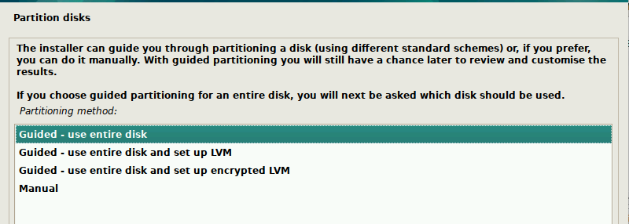
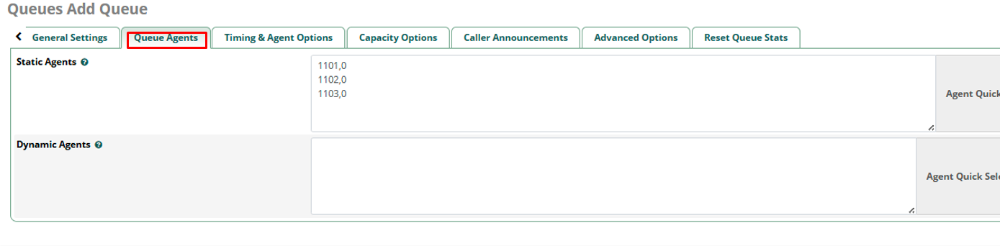

% Розгортання кастомного FreePBX для малого контакт-центру
% Костянтин Кочеврін
% Квітень 2025

# Зміст

- [Зміст](#зміст)
  - [Вступ](#вступ)
    - [Мета керівництва](#мета-керівництва)
    - [Про FreePBX та Ansible](#про-freepbx-та-ansible)
    - [Область застосування та обмеження](#область-застосування-та-обмеження)
  - [Установка](#установка)
    - [Системні вимоги](#системні-вимоги)
    - [Підготовка середовища](#підготовка-середовища)
    - [Установка FreePBX за допомогою Ansible](#установка-freepbx-за-допомогою-ansible)
    - [Перевірка установки](#перевірка-установки)
  - [Принцип роботи](#принцип-роботи)
    - [Огляд архітектури системи](#огляд-архітектури-системи)
    - [Компоненти конфігурації FreePBX](#компоненти-конфігурації-freepbx)
    - [Призначення основних компонентів](#призначення-основних-компонентів)
      - [Внутрішні номери (Extensions)](#внутрішні-номери-extensions)
      - [Транки (Trunks)](#транки-trunks)
      - [Діапазони номерів та маршрути](#діапазони-номерів-та-маршрути)
    - [Приклад базової роботи системи](#приклад-базової-роботи-системи)
    - [Особливості налаштування для контакт-центру](#особливості-налаштування-для-контакт-центру)
      - [Черга (Queue)](#черга-queue)
    - [Графік роботи та додаткові компоненти](#графік-роботи-та-додаткові-компоненти)
    - [Підсумок](#підсумок)
  - [Практичне налаштування](#практичне-налаштування)
    - [Створення облікового запису адміністратора](#створення-облікового-запису-адміністратора)
    - [Налаштування SIP](#налаштування-sip)
      - [Для чого служить Local Networks в Asterisk SIP Settings?](#для-чого-служить-local-networks-в-asterisk-sip-settings)
    - [Створення внутрішніх номерів (Extensions)](#створення-внутрішніх-номерів-extensions)
    - [Проведення тестового дзвінка](#проведення-тестового-дзвінка)
    - [Налаштування транків (Trunks)](#налаштування-транків-trunks)
    - [Діапазони номерів та маршрути (практичне налаштування)](#діапазони-номерів-та-маршрути-практичне-налаштування)
      - [Вхідні маршрути (Inbound Routes)](#вхідні-маршрути-inbound-routes)
      - [Вихідні маршрути (Outbound Routes)](#вихідні-маршрути-outbound-routes)
    - [Створення черги для номерів відділу](#створення-черги-для-номерів-відділу)
    - [Створення черги для контакт-центру](#створення-черги-для-контакт-центру)
      - [Налаштування запису розмов (System Recordings)](#налаштування-запису-розмов-system-recordings)
      - [Налаштування оголошень (Announcements)](#налаштування-оголошень-announcements)
      - [Створення тимчасових груп (Time Groups)](#створення-тимчасових-груп-time-groups)
      - [Налаштування тимчасових умов (Time Conditions)](#налаштування-тимчасових-умов-time-conditions)
      - [Налаштування музики очікування (Music on Hold)](#налаштування-музики-очікування-music-on-hold)
      - [Створення IVR (Interactive Voice Response)](#створення-ivr-interactive-voice-response)
      - [Створення черги контакт-центру](#створення-черги-контакт-центру)
      - [Налаштування вхідного маршруту для контакт-центру](#налаштування-вхідного-маршруту-для-контакт-центру)
  - [Висновок](#висновок)
    - [Що ми отримали](#що-ми-отримали)
    - [Рекомендації щодо подальшого вдосконалення](#рекомендації-щодо-подальшого-вдосконалення)

## Вступ

### Мета керівництва
Це керівництво призначене для системних адміністраторів, які хочуть розгорнути телефонну станцію (АТС) для своєї організації, але не мають досвіду роботи з телефонією. У цьому мануалі не буде глибокого пояснення базових понять адміністрування операційних систем, мережевих технологій та інших аспектів, які виходять за рамки нашого завдання. Ми зосередимося виключно на налаштуванні АТС для потреб організації та невеликого контакт-центру. У керівництві будуть розглянуті основні аспекти роботи АТС та взаємозв'язок її ключових компонентів.

### Про FreePBX та Ansible
Вибір припав на АТС на базі [Asterisk](https://www.asterisk.org/), а саме на [FreePBX](https://www.freepbx.org/), з кількох причин. По-перше, [FreePBX](https://www.freepbx.org/) — це один із найбільш зручних та стабільних продуктів, який пережив багатьох конкурентів і продовжує розвиватися. Він не перевантажений численними налаштуваннями та опціями, дозволяючи без особливих зусиль налаштувати майже все необхідне через веб-інтерфейс.

Існує кілька способів розгортання [FreePBX Distro](https://www.freepbx.org/downloads/):

- **Установка з офіційного ISO-образу [FreePBX Distro](https://www.freepbx.org/downloads/)**. Цей метод зручний тим, що система постачається з передвстановленими всіма необхідними модулями, однак він досить важкий. Включає багато додаткових компонентів, деякі з яких комерційні і, швидше за все, не будуть використані у більшості сценаріїв. Це робить інтерфейс перевантаженим, а також збільшує кількість вразливостей, як і будь-яке додаткове ПЗ. У цьому випадку простіше встановити лише необхідні компоненти, ніж потім очищати систему від зайвого.

- **Збірка з вихідних кодів [Asterisk](https://www.asterisk.org/) та установка окремих компонентів** (наприклад, бази даних, веб-сервера, веб-інтерфейсу [FreePBX](https://www.freepbx.org/)). Цей варіант дозволяє більш детально розібратися у процесі установки та зрозуміти, як пов'язані всі компоненти системи. Однак налаштування та збірка з нуля — процес досить трудомісткий і виходить за рамки цього керівництва.

- **Я обрав третій шлях — автоматизував процес за допомогою [Ansible](https://www.ansible.com/)**. Однак, щоб не винаходити велосипед, я вирішив не писати власний плейбук, а пошукати готове рішення в інтернеті. Я знайшов кілька варіантів, обрав найсвіжіший, зробив форк репозиторію та протестував. Установка не пройшла з першого разу, і мені довелося виправити кілька помилок, видаливши все зайве, а потім додавши лише необхідні компоненти. У результаті я отримав плейбук, який розгортає [Asterisk](https://www.asterisk.org/) та [FreePBX](https://www.freepbx.org/) з останніми стабільними версіями за кілька хвилин (залежно від продуктивності сервера).

### Область застосування та обмеження
У рамках цієї статті ми будемо розглядати налаштування IP-телефонії для організації. Основні завдання: внутрішній зв'язок між співробітниками та підрозділами, а також організація контакт-центру, основним завданням якого є обробка вхідних дзвінків від клієнтів та здійснення вихідних дзвінків. У статті не буде розглядатися налаштування автоматичного обдзвону за базою номерів та інші більш складні сценарії, які потребують додаткових модулів та налаштувань.

## Установка

### Системні вимоги
Для установки Asterisk/FreePBX буде використовуватися, скоріше за все, віртуальна машина або хмарний інстанс. На етапі початкового розгортання достатньо виділити:

- **2 ядра процесора**
- **2 ГБ оперативної пам'яті**

Цього цілком достатньо для базової роботи системи та проведення тестів. При необхідності ці ресурси завжди можна збільшити — масштабування у віртуальному середовищі зазвичай не викликає труднощів.

Що стосується сховища, то для тестової інсталяції підійде диск об'ємом **20–30 ГБ**. Однак, якщо планується використовувати систему в продакшені, варто відразу виділити **не менше 100 ГБ** під основний диск.

Також рекомендується передбачити **окремий диск або розділ** під зберігання записів розмов. Його об'єм безпосередньо залежить від наступних факторів:

- об'єм вхідного/вихідного трафіку;
- необхідність і тривалість зберігання записів;
- формат аудіофайлів (наприклад, WAV займає більше місця, ніж MP3).

У реальних сценаріях використання об'єм сховища під записи може легко перевищити сотні гігабайт, особливо при тривалому зберіганні.

### Підготовка середовища
- Установка Debian 12 на Hyper-V (в моєму випадку)

Для установки Asterisk/FreePBX на Hyper-V я використовую останню стабільну версію **Debian 12** в мінімальній установці з SSH сервером. Процес установки буде таким:

- Скачати образ **Debian 12** з офіційного сайту:

   - [Скачування Debian 12](https://www.debian.org/download)
   - [Образ ISO для установки](https://cdimage.debian.org/debian-cd/current/amd64/iso-cd/debian-12.10.0-amd64-netinst.iso)

- У процесі установки:
   - **Мова установки** — вибираємо англійську.
   - **Пароль для root** та **користувача без привілеїв** — запам'ятовуємо, для спрощення процесу можна встановити однакові паролі.
   - **Тайм-зона** — значення не має, можна залишити за замовчуванням, пізніше налаштуємо в плейбуці.
   - При розбитті диска вибираємо **весь диск**, всі файли знаходяться на одному розділі. Можна відразу додати додатковий диск для записів розмов, але для тестової установки це не обов'язково.

   
   

   - **Графічний інтерфейс** не встановлюємо, вибираємо тільки системні утиліти та SSH сервер.

   

- Після установки:

  Створений користувач **без адмін привілегій**. Для спрощення, дозволимо root'у логінитися по SSH, але не забудемо повернути це в безпечний стан пізніше, якщо це необхідно.

Для дозволу входу під root по SSH:

```bash
# Log in as the created user
su - <root_password>
# Edit the SSH configuration
vi /etc/ssh/sshd_config
# Uncomment the line and change the value to yes
PermitRootLogin yes
# Restart the SSH server
systemctl restart sshd
```

> **Важливо!** *У випадку хмарного інстанса налаштування `PermitRootLogin yes` може не спрацювати. Це може бути пов'язано з додатковими налаштуваннями безпеки, які застосовуються в хмарі. У таких випадках потрібно перевірити інклуди (включення) в конфігурації SSH, яка знаходиться в файлі `/etc/ssh/sshd_config`. Можливо, там буде вказано `PermitRootLogin no`, що блокує можливість входу під **root**.
Якщо це так, потрібно внести зміни в конфігурацію і перезапустити SSH сервер.
Після того як все налаштовано правильно, можна увійти по SSH під користувачем **root** і продовжити установку.*

- Установка ansible:
Для автоматичного деплоймента через Ansible-плейбук, необхідно встановити Ansible на керуючій машині. Керуючою може бути будь-яка ОС: Linux, macOS або Windows (через WSL).

Debian/Ubuntu:
```bash
sudo apt update
sudo apt install -y ansible
```
macOS (через Homebrew):
```bash
brew install ansible
```
Windows:
```bash
Установіть WSL і виберіть дистрибутив Linux (наприклад, Ubuntu).
Затем використовуйте інструкції для Debian/Ubuntu вище всередині WSL.
```

### Установка FreePBX за допомогою Ansible

- Переходимо в директорію для проектів і клонуємо плейбук з GitHub:
```bash
cd /home/youruser/projects
git clone https://github.com/kochevrin/ansible-freepbx.git
cd ansible-freepbx
``` 

- Вказуємо IP-адресу вашої машини з Debian:
  - Переіменуйте файл servers.example в servers:
    ```bash
    mv inventory/servers.example inventory/servers
    ``` 
  - Редагуємо рядок `root ansible_host=192.168.0.99 ansible_user=root` в файлі `inventory/servers`:
  - Замість 192.168.0.99 вкажіть IP-адресу вашої Debian-машини.
  
- Редатируем файл `playbooks/Debian-FreePBX17/vars/versions.yml` і вказуємо потрібні версії:

  - Перед установкою рекомендується переконатися, що ви використовуєте останні стабільні версії компонентів:
  - **Asterisk** – останні стабільні версії доступні на офіційному сайті:  
    [https://downloads.asterisk.org/pub/telephony/asterisk/](https://downloads.asterisk.org/pub/telephony/asterisk/)

  - **FreePBX** – актуальні релізи та вихідні коди можна знайти на GitHub:  
    [https://github.com/FreePBX/framework](https://github.com/FreePBX/framework)
  
  - У моєму випадку це останні стабільні на момент написання статті.
  
    > asterisk_version: 21.8.0

    >freepbx_version: "17.0"

- Запускаємо плейбук і чекаємо закінчення установки, процес може зайняти до 15 хвилин, в залежності від продуктивності машини, довше за все займає збірка астериск з вихідних кодів:
```bash
ansible-playbook playbooks/Debian-FreePBX17/freepbx17.yml -i inventory/servers --ask-pass
```
Після закінчення, бачимо щось подібне:


### Перевірка установки
- Перевірка стану сервісів
   - Переконайтеся, що основні служби запущені:
     ```bash
     systemctl status asterisk
     systemctl status apache2
     ```
     Якщо все в порядку, ви побачите статус active (running).

- Перевірка веб-інтерфейсу FreePBX
    - Відкрийте браузер і перейдіть по IP-адресі вашої Debian-машини:
  
      `http://<IP_адрес_вашої_машини>`

      Має відкритися сторінка установки FreePBX.


## Принцип роботи

### Огляд архітектури системи

FreePBX використовує Asterisk в якості ядра для обробки викликів та взаємодії з SIP-протоколом, а також надає зручний веб-інтерфейс для налаштування та управління. Архітектура системи складається з кількох ключових компонентів:

- **Asterisk** — ядро системи, яке відповідає за обробку викликів, маршрутизацію, голосові меню (IVR) та інші функції IP-телефонії.
- **FreePBX GUI** — веб-інтерфейс для управління Asterisk. Він значно спрощує налаштування системи, надаючи зручні форми для введення параметрів SIP-транків, внутрішніх номерів, IVR та інших елементів.
- **База даних MySQL/MariaDB** — використовується для зберігання конфігурацій, даних користувачів та логів викликів.
- **Apache (або інший веб-сервер)** — забезпечує доступ до веб-інтерфейсу FreePBX.

Взаємодія між компонентами забезпечує гнучкість і можливість масштабування системи під потреби організації.

### Компоненти конфігурації FreePBX

Коли я починав свій шлях в IP-телефонії, найскладнішою задачею для мене було глобальне розуміння того, як все працює і як пов'язані між собою компоненти системи. На той момент існувало безліч статей і керівництв, які пояснювали, як встановити IP-АТС, налаштувати пару внутрішніх номерів і протестувати дзвінок між ними. Однак в реальних сценаріях, особливо для задач запуску контакт-центру, такі інструкції виявлялися мало корисними.

Система була перевантажена безліччю термінів і сутностей — внутрішніх номерів (Extensions), транків (Trunks), пірів (Peers), черг (Queues), маршрутів (Inbound/Outbound Routes), анонсментів (Announcements) та інших. Побудувати в голові зв'язок між ними було, напевно, найскладнішим етапом. Але як тільки ця картина ставала ясною, подальша робота значно спрощувалася.

---

### Призначення основних компонентів

#### Внутрішні номери (Extensions)
Внутрішні номери створюються для зв'язку між співробітниками всередині АТС. Наприклад, співробітник з відділу кадрів може зателефонувати в IT-відділ, просто набравши його внутрішній номер. Це базова функціональність, яка дозволяє організувати телефонну зв'язок всередині офісу.

#### Транки (Trunks)
Для спілкування з зовнішнім світом необхідна зв'язок з провайдером. Саме це і забезпечують транки. Транк — це канал, через який дзвінки виходять за межі АТС або надходять всередину від зовнішніх абонентів.

Транки можуть бути різних типів:
1. **SIP-провайдери** — надають послуги IP-телефонії для здійснення дзвінків на мобільні та міські номери.
2. **GSM-шлюзи** — пристрої з кількома SIM-картами, які дозволяють дзвонити через мобільні мережі, по суті мобільний телефон з безліччю сим-карт, здатний взаємодіяти з IP-АТС.
3. **Інші IP-АТС** — використовуються для об'єднання кількох підрозділів або організацій. Наприклад, якщо у двох офісів вже є свої АТС, транк дозволяє зв'язати їх між собою.

При використанні транків між різними АТС необхідно враховувати нумерацію, щоб уникнути перетворення діапазонів внутрішніх номерів.

#### Діапазони номерів та маршрути
Внутрішні номери часто групуються в діапазони для зручності:
- Відділ кадрів: 100–199
- Фінансовий відділ: 200–299
- Підтримка: 300–399
- Контакт-центр: 400–499
- Відділ рекламації: 500–599

Крім того, для роботи з зовнішніми дзвінками необхідно налаштувати маршрути:
- **Вхідні маршрути (Inbound Routes)** — визначають, що робити з викликами, які надходять на транк. Наприклад, дзвінки на номер компанії можуть бути направлені в IVR, чергу або на конкретний внутрішній номер.
- **Вихідні маршрути (Outbound Routes)** — визначають, як дзвінки з внутрішніх номерів направляються у зовнішній світ. Наприклад, дзвінки на номери в міжнародному форматі (+380 50 XXX XX XX) відправляються через SIP-провайдера.

---

### Приклад базової роботи системи

Після налаштування всіх вищезазначених компонентів офіс отримує такі можливості:
- Внутрішні дзвінки між співробітниками.
- Вхідні та вихідні дзвінки через зовнішні номери (транки).
- Маршрутизацію дзвінків на основі заданих правил.

Для більшості офісів такої функціональності може бути достатньо. Додатково можна налаштувати обробку дзвінків у неробочий час або перенаправлення незайнятих викликів.

---

### Особливості налаштування для контакт-центру

Контакт-центр працює з більш складною логікою. Наприклад, якщо в контакт-центрі працює 20 операторів, вони повинні обслуговувати вхідні дзвінки, що надходять на один загальний номер (або кілька, наприклад номери на сайті). Такий номер повинен підтримувати багатоканальні з'єднання, щоб одночасно приймати кілька дзвінків і розподіляти їх між операторами за заданою логікою. Для забезпечення подібної схеми роботи нам знадобиться такий компонент IP-АТС, як "черга".

#### Черга (Queue)
Черга дозволяє приймати і розподіляти вхідні дзвінки між операторами. Принцип роботи тут інший: замість того, щоб направляти кожен дзвінок на конкретний внутрішній номер, всі дзвінки надходять через транк -> вхідний маршрут на чергу. У свою чергу, черга розподіляє дзвінки між операторами за заданими алгоритмами.

Приклади алгоритмів:
- Усі оператори отримують сповіщення про дзвінок (хто перший відповів, той обслуговує клієнта).
- Дзвінок передається операторам по черзі, переходячи до наступного, якщо поточний оператор не відповів за встановлений час.

Черга також може утримувати дзвінок, якщо всі оператори зайняті, відтворюючи привітання або музику очікування. Налаштування черги дозволяють врахувати практично всі сценарії обробки викликів.

---

### Графік роботи та додаткові компоненти

Для забезпечення графіка роботи контакт-центру використовуються наступні компоненти в FreePBX:

1. **Time Groups**  
   Групи тимчасових інтервалів задають розклад роботи контакт-центру, наприклад, з 9:00 до 18:00 в будні дні.

2. **Time Conditions**  
   Умови часу визначають, що робити з дзвінками, які надходять в різний час. Наприклад:
   - В робочий час дзвінки направляються в чергу.
   - В неробочий час відтворюється голосове повідомлення (Announcement) або дзвінок перенаправляється на автоответчик.

3. **Announcements**  
   Анонсменты відтворюють заздалегідь записані голосові повідомлення. Наприклад, повідомлення про те, що компанія працює тільки в певні години.

4. **IVR (Interactive Voice Response)**  
   IVR — це інтерактивне голосове меню, яке дозволяє клієнтам вибрати потрібний відділ або послугу. Наприклад: "Натисніть 1, щоб зв'язатися з відділом продажу, натисніть 2 для технічної підтримки".

---

### Підсумок
Це загальна логіка і взаємозв'язок між основними компонентами FreePBX, які ми будемо використовувати для налаштування системи під задачі малого офісу і контакт-центру. У наступних розділах ми розглянемо покрокову настройку кожного компонента.

## Практичне налаштування

### Створення облікового запису адміністратора

Після успішної установки FreePBX створюємо обліковий запис адміністратора. На екрані реєстрації вводимо необхідні дані і натискаємо "Create Admin".


Після створення облікового запису логінемося в FreePBX Administration, вибираємо мову інтерфейсу. Рекомендується використовувати англійську мову, так як більшість прикладів і документації доступні саме на ній. Після застосування мовних налаштувань і натискання кнопки "Apply" ви потрапите на дашборд.

### Налаштування SIP

1. Переходимо в меню **Settings > Asterisk SIP Settings**.
2. На вкладці **General SIP Settings**:
   - Вказуємо зовнішню IP-адресу (можна автоматично визначити кнопкою "Detect").
   - Додаємо локальні мережі (Local Networks).

#### Для чого служить Local Networks в Asterisk SIP Settings?
Local Networks (локальні мережі) — це список IP-підсетей, які Asterisk буде вважати "внутрішніми", тобто локальними. Це безпосередньо впливає на обробку SIP і RTP трафіку (голосові дані).

3. Діапазон RTP залишаємо без змін, інші параметри на цій вкладці також залишаємо без змін.


4. На вкладці **SIP Settings [chan_pjsip]**:
   - Перевіряємо порт і виставляємо значення **5060**.


5. На кожній з вкладок окремо натискаємо "`Submit`" і "Apply" у разі внесення змін.

### Створення внутрішніх номерів (Extensions)

1. Переходимо в меню **Connectivity > Extensions** (в попередніх версіях FreePBX дане налаштування знаходилося в **Applications > Extensions**).
2. Натискаємо "Add Extension".


3. Заповнюємо обов'язкові поля:
   - **User Extension** — внутрішній номер.
   - **Display Name** — ім'я, що відображається у приймаючої сторони під час вхідного виклику.
   - **Secret** — пароль (для тесту можна вказати простий, але в реальній експлуатації рекомендується використовувати автоматично згенерований пароль).


4. На вкладці **Advanced** вмикаємо запис розмов, якщо це необхідно.


5. Натискаємо "`Submit`" і "`Apply Config`". Номер створено і з'явився в інтерфейсі.

6. Для створення кількох номерів використовуємо модуль **Bulk Handler** (Admin > Bulk Handler):
   - Натискаємо "Export" і зберігаємо файл.


   - У файлі дублюємо рядок раніше створеного номера, змінюючи значення для кожного нового номера (номер, відображуване ім'я, пароль).
   - Імпортуємо змінений файл.

7. Після імпорту заходимо в **Connectivity > Extensions** і бачимо створені номери. Наприклад, 9 номерів у трьох діапазонах для трьох відділів.


> Якщо використання Bulk Handler здається складним, можна створити номери вручну.

### Проведення тестового дзвінка

Для тестування можна використовувати IP-телефони або софтфони на ПК. У даному прикладі використовуються два софтфона: один у віртуальній машині, інший на хостовій машині.

Рекомендуваний SIP-клієнт: [Microsip](https://www.microsip.org/downloads).


Після налаштування і тестування дзвінків у обидві сторони можна перевірити записи про події на АТС, а також прослухати і завантажити файли записів, якщо запис для номерів була включена.


### Налаштування транків (Trunks)

Транки забезпечують зв'язок з зовнішніми мережами, такими як SIP-провайдери або GSM-шлюзи. Для налаштування транків:

1. Переходимо в меню **Connectivity > Trunks**.
2. Натискаємо "Add Trunk" і вибираємо тип транка (add SIP (chan_pjsip)).
3. Заповнюємо обов'язкові поля:
   - **Trunk Name** — ім'я транка.
   - **Outbound CallerID** — номер, який буде відображатися у викликаній сторони (не завжди обов'язково).
4. На вкладці **pjsip Settings General** вказуємо:
   - **Username** і **Secret** — дані, надані провайдером.
   - **SIP Server** — адреса сервера провайдера.
   - **SIP Server Port** — порт SIP провайдера.
5. На вкладці **pjsip Settings Advanced** вказуємо:
   - **Contact User** — мінімально, у випадку реєстрації по IP.
   - **From User, Server URI і пр.** — у випадку реєстрації по логіну/паролю.

*Транки з провайдером можуть бути з реєстрацією по IP, а можуть бути з реєстрацією по логіну/паролю.*

- **Транк з реєстрацією по логіну/паролю** зазвичай створюється один для кожної лінії (наприклад, якщо у вас десять ліній, то потрібно створити десять транків).
- **Транк з реєстрацією по IP** зазвичай один, але вже в собі містить якусь кількість ліній, яке надає провайдер.

*У кожного підходу є свої недоліки і переваги:*

- **З реєстрацією по IP**:
  - Простішу в налаштуванні зі сторони PBX, не потрібно створювати транк для кожної лінії.
  - Однак зі сторони маршрутизатора, якщо АТС знаходиться за NAT провайдера, потрібно робити проброси з IP-адреси провайдера на порти SIP і RTP АТС.
  - Мінусом є те, що при проблемах з інтернетом і переключенні на резервного провайдера необхідно заздалегідь реєструвати свої зовнішні IP у провайдера телефонии і здійснювати очищення connections на маршрутизаторі, якщо переключення відбулося. Не завжди це працює безшовно.

- **З реєстрацією по логіну/паролю**:
  - Більше сутностей доводиться створювати на АТС.
  - Зато АТС сама реєструється у провайдера телефонии, на неї не потрібно пробрасывать порти SIP і RTP.
  - Зміна IP зазвичай проходить безшовно.

*Налаштування транків з провайдерами телефонии ми детально розбирати не будемо, так як вони у багатьох випадках можуть відрізнятися. При укладенні договору з провайдером телефонии вони зазвичай надають документацію, що саме їм потрібно, щоб транк піднявся.*

Приклад налаштування транка з реєстрацією по IP:


1. Натискаємо "`Submit`" і "`Apply Config`" для збереження змін.

### Діапазони номерів та маршрути (практичне налаштування)

Для роботи з зовнішніми дзвінками необхідно налаштувати маршрути:

#### Вхідні маршрути (Inbound Routes)
1. Переходимо в меню **Connectivity > Inbound Routes**.
2. Натискаємо "Add Inbound Route".
3. Заповнюємо обов'язкові поля:
   - **Description** — опис маршруту.
   - **DID Number** — номер, на який надходять дзвінки (у випадку з безліччю транків з номерами, що відрізняються постфіксами, можна використовувати шаблон, щоб одним маршрутом покрити всі номери, шаблони в asterisk починаються з нижнього підкреслення).
4. Вказуємо, куди направляти дзвінки (наприклад, в чергу або на внутрішній номер або, як у нашому випадку, на Time condition (його ми його не створили, можна направити на якийсь з раніше створених внутрішніх номерів, повернемося до цього пізніше).


5. Натискаємо "`Submit`" і "`Apply Config`".

#### Вихідні маршрути (Outbound Routes)
1. Переходимо в меню **Connectivity > Outbound Routes**.
2. Натискаємо "Add Outbound Route".
3. Заповнюємо обов'язкові поля:
   - **Route Name** — ім'я маршруту.
   - **Route CID** — опціонально.
   - **Dial Patterns** — шаблони номерів, при наборі яких буде використовуватися цей маршрут і шаблони внутрішніх номерів, на які буде поширюватися дане правило (в нашому прикладі `0XXXXXXXXX` всі десятизначні номери, які починаються з нуля і діють для `XXXX` - всіх чотиризначних номерів).
4. Вказуємо транк, через який будуть здійснюватися дзвінки.


5. Натискаємо "`Submit`" і "`Apply Config`".
6. Для вихідних маршрутів важливий порядок, маршрут, розташований вище, спрацьовує першим.


### Створення черги для номерів відділу

Черга дозволяє розподіляти вхідні дзвінки між кількома операторами відділу. Для створення черги:

1. Переходимо в меню **Applications > Queues**.
2. Натискаємо "Add Queue".
3. Заповнюємо обов'язкові поля:
   - **Queue Number** — номер черги (наприклад, 400 для відділу продажу).
   - **Queue Name** — ім'я черги (наприклад, "Sales Department").
4. Налаштовуємо параметри черги:
   - **Ring Strategy** — стратегія виклику (наприклад, "rrmemory" для рівномірного розподілу дзвінків або "ringall" для одночасного виклику всіх учасників черги).
   - **Failover Destination** — куди направляти дзвінки, якщо всі оператори зайняті (наприклад, на голосову пошту або "Terminate Call -> Hangup" для скидання дзвінка через заданий час, якщо в черзі його не прийняли).
   - **Queue Agents** - на цій вкладці додаємо внутрішні номери агентів, учасників черги.
   - Налаштування часу життя дзвінка в черзі

    Час життя дзвінка в черзі (Queue Timeout) визначає, скільки часу дзвінок може перебувати в черзі, перш ніж буде виконано дію за замовчуванням (наприклад, перенаправлення на голосову пошту або інший номер). Для налаштування:

    1. Переходимо в меню **Applications > Queues > Timing & Agent Options**.
    4. Налаштовуємо параметри перебування дзвінка в черзі. Налаштування повинні корелювати з раніше обраною стратегією дзвінка в моєму випадку "`Agent Timeout`" встановлено на 10 секунд, значить, при стратегії "`rrmemory`" телефон кожного учасника буде дзвонити десять секунд і переходити до наступного. Час перебування в черзі "`Max Wait Time`" - Unlimited (необмежено).





5. Натискаємо "`Submit`" і "`Apply Config`" для збереження змін.

Після створення черги необхідно налаштувати вхідний маршрут, щоб дзвінки на номер відділу направлялися в цю чергу:

1. Переходимо в меню **Connectivity > Inbound Routes**.
2. Натискаємо "Add Inbound Route".
3. Заповнюємо обов'язкові поля:
   - **Description** — опис маршруту (наприклад, "Sales Queue Route").
   - **DID Number** — номер, на який надходять дзвінки (наприклад, зовнішній номер відділу).
4. В полі **Set Destination** вибираємо створену чергу.


5. Натискаємо "`Submit`" і "`Apply Config`".

> Дана конфігурація (при наявності необхідної кількості зовнішніх транків/номерів) в принципі достатня для потреб офісу. Усі створені внутрішні номери можуть спілкуватися між собою. У різних відділів є свої зовнішні номери, з яких вони отримують вхідні дзвінки на чергу відділу або прямий дзвінок на номер, відповідно до налаштувань у вхідних маршрутах. Також у них є номери, через які вони можуть дзвонити у зовнішній світ (згідно з правилами, прописаними в вихідних маршрутах). У нашому випадку вони не зможуть зателефонувати в іншу країну, так як номер повинен підпадати під шаблон `0XXXXXXXXX`.

### Створення черги для контакт-центру

Налаштування черги для контакт-центру вимагає створення та налаштування додаткових компонентів для забезпечення професійного обслуговування клієнтів. На відміну від простої черги відділу, для контакт-центру необхідно налаштувати музику очікування, голосові привітання, тимчасові групи, тимчасові умови та інтерактивне голосове меню (IVR).

#### Налаштування запису розмов (System Recordings)

Записи повідомлень потрібні для відтворення різних голосових привітань та сповіщень. Для створення запису:

1. Переходимо в меню **Admin > System Recordings**.
2. Натискаємо "Add Recording".
3. Заповнюємо поля:
   - **Recording Name** — назва запису (наприклад, "welcome_message").
   - **Description** — опис запису (наприклад, "Привітальне повідомлення контакт-центру").
4. Вибираємо спосіб створення запису:
   - **Upload File** — завантажити готовий аудіофайл у форматі WAV або MP3.
   - **Record from Phone** — записати з телефону (вказати внутрішній номер для запису).
5. При запису з телефону система згенерує спеціальний номер. Подзвоніть на цей номер і запишіть повідомлення.
6. Натискаємо "`Submit`" і "`Apply Config`".

Рекомендується створити кілька записів:
- Привітальне повідомлення ("Ласкаво просимо в компанію...")
- Повідомлення про час роботи, відтворюється в неробочий час ("Наші оператори працюють з 9:00 до 18:00...")

#### Налаштування оголошень (Announcements)

Об'явлення дозволяють відтворювати записані повідомлення перед направленням дзвінка далі:

1. Переходимо в меню **Applications > Announcements**.
2. Натискаємо "Add Announcement".
3. Заповнюємо поля:
   - **Announcement Description** — опис (наприклад, "Привітання контакт-центру").
   - **Recording** — вибираємо створену раніше запис.
   - **Allow Skip** — дозволити пропустити оголошення (зазвичай "No").
   - **Return to IVR** — повернутися в IVR після оголошення (зазвичай "No" для простих оголошень).
4. В полі **Destination after playback** вибираємо, куди направити дзвінок після відтворення, в нашому випадку це буде черга контакт-центру, але, так як її поки не створили, вибираємо будь-яку сутність, наприклад **extension** <span style="color: red;">(не забути змінити на **Queue 401**)</span> після налаштування черги.
5. Натискаємо "`Submit`" і "`Apply Config`".


#### Створення тимчасових груп (Time Groups)

Тимчасові групи визначають робочі години контакт-центру:

1. Переходимо в меню **Applications > Time Groups**.
2. Натискаємо "Add Time Group".
3. Заповнюємо поля:
   - **Description** — опис (наприклад, "Робочі години контакт-центру").
   - **Time to Start** — час роботи у форматі години:хвилини-години:хвилини (наприклад, "09:00-18:00").
   - **Week Day Start** — час роботи у форматі години:хвилини-години:хвилини (наприклад, "09:00-18:00").
   - **Week Day finish** — дні тижня (вибираємо Monday-Friday для робочих днів).
4. Натискаємо "`Submit`" і "`Apply Config`".
5. В одній Time Group може бути кілька розкладів. Наприклад для Monday-Friday одне розклад, для Saturday - інше. Якщо розклади перетинаються між собою, то спрацьовує більш конкретне, наприклад якщо є розклад для Monday-Friday, але ще вказаний конкретний день, конкретного місяця, то в цей день розклад переоприділиться.

#### Налаштування тимчасових умов (Time Conditions)

Тимчасові умови перевіряють поточний час і направляють дзвінки по різним маршрутам:

1. Переходимо в меню **Applications > Time Conditions**.
2. Натискаємо "Add Time Condition".
3. Заповнюємо поля:
   - **Time Condition Name** — назва (наприклад, "Перевірка робочого часу").
   - **Time Group** — вибираємо створену тимчасову групу.
   - **Destination matches** — куди направити дзвінок в робочий час (наприклад, в IVR або чергу). В нашому випадку це раніше створений **Announcement** "Привітання контакт-центру".
   - **Destination non-matches** — куди направити дзвінок в неробочий час (наприклад, на голосову пошту або оголошення про закриття). В нашому випадку це буде **IVR**
4. Натискаємо "`Submit`" і "`Apply Config`".

#### Налаштування музики очікування (Music on Hold)

Музика очікування відтворюється, коли клієнт знаходиться в черзі або його ставлять на утримання, для переведення дзвінка на іншого оператора:

1. Переходимо в меню **Settings > Music on Hold**.
2. Натискаємо "Add Music Category".
3. Заповнюємо поля:
   - **Category Name** — назва категорії (наприклад, "contact_center_music").
   - **Music Type** — тип музики (зазвичай "Files").
4. Завантажуємо аудіофайли у форматах WAV, MP3 або інших підтримуваних.
5. Натискаємо "`Submit`" і "`Apply Config`".

#### Створення IVR (Interactive Voice Response)

IVR надає клієнтам голосове меню з можливістю вибору:

1. Переходимо в меню **Applications > IVR**.
2. Натискаємо "Add IVR".
3. Заповнюємо основні поля:
   - **IVR Name** — назва (наприклад, "Головне меню контакт-центру").
   - **Announcement** — вибираємо створене привітальне оголошення.
   - **Enable Directory** — включити довідник (зазвичай "No" для контакт-центру).
   - **Enable Direct Dial** — дозволити прямий набір номерів (зазвичай "No").
4. Налаштовуємо опції меню:
   - **IVR Entries** — додаємо варіанти вибору:
     - Цифра "1" — направити в чергу технічної підтримки
     - Цифра "2" — направити в чергу продажу
     - Цифра "0" — з'єднати з оператором
     - Цифра "9" — повторити меню
5. Налаштовуємо додаткові параметри:
   - **IVR Timeout** — час очікування вводу (наприклад, 10 секунд).
   - **Invalid Retry** — кількість спроб при невірному вводі (зазвичай 3).
   - **Timeout Retry** — кількість спроб при відсутності вводу (зазвичай 3).
   - **Invalid Destination** — куди направити при невірному вводі.
   - **Timeout Destination** — куди направити при відсутності вводу.
6. Натискаємо "`Submit`" і "`Apply Config`".
7. Якщо ж якихось служб, що обробляють дзвінки в неробочий час немає, то в налаштуваннях **Time Conditions** можна вибрати **Destination non-matches** -> **Announcement** c відтворенням повідомлення про те, що контакт-центр не працює і озвучити графік робочого часу. Я все ж рекомендую налаштувати простий **IVR** c відтворенням того ж повідомлення, дане налаштування в кінцевому підсумку приводить до того ж результату, але **IVR** в відміну від **Announcement** дозволить, якщо виникне необхідність, отримати номер дзвонячого, з допомогою кастомного контексту, і відправити його в якусь crm систему, канал teams або tg. Для того, щоб в робочий час оператори могли обробити пропущені дзвінки

#### Створення черги контакт-центру

Після налаштування всіх компонентів створюємо основну чергу:

1. Переходимо в меню **Applications > Queues**.
2. Натискаємо "Add Queue".
3. Заповнюємо основні поля:
   - **Queue Number** — номер черги (наприклад, 401).
   - **Queue Name** — ім'я черги (наприклад, "Contact Center Main Queue").
   - **CID Name Prefix** — префікс для ідентифікації дзвінків з черги.
4. Налаштовуємо стратегію обробки дзвінків:
   - **Ring Strategy** — вибираємо "leastrecent" (дзвінок надходить агенту, який найдовше всіх не приймав дзвінки).
   - **Failover Destination** — напрямок при недоступності агентів.
5. На вкладці **Timing & Agent Options**:
   - **Agent Timeout** — час дзвінка агенту (наприклад, 15 секунд).
   - **Max Wait Time** — максимальний час очікування в черзі (наприклад, 300 секунд).
   - **Retry** — інтервал між спробами (наприклад, 5 секунд).
6. На вкладці **Music & Announcements**:
   - **Music on Hold Class** — вибираємо створену категорію музики.
   - **Periodic Announce** — періодичні оголошення для очікуючих.
   - **Announce Frequency** — частота оголошень (наприклад, кожні 30 секунд).
7. На вкладці **Agents**:
   - Додаємо внутрішні номери операторів контакт-центру.
   - Налаштовуємо **Penalty** (пріоритет) для кожного агента (0 = вищий пріоритет).
8. Натискаємо "`Submit`" і "`Apply Config`".

#### Налаштування вхідного маршруту для контакт-центру

Фінальний крок — створення вхідного маршруту:

1. Переходимо в меню **Connectivity > Inbound Routes**.
2. Натискаємо "Add Inbound Route".
3. Заповнюємо поля:
   - **Description** — опис (наприклад, "Contact Center Main Route").
   - **DID Number** — основний номер контакт-центру.
4. В полі **Set Destination** вибираємо:
   - Тимчасове умова (Time Condition) для перевірки робочого часу, або
   - Створене IVR для прямого потрапляння в голосове меню
5. Натискаємо "`Submit`" і "`Apply Config`".

Після виконання всіх налаштувань вхідні дзвінки будуть:
1. Перевірятися на відповідність робочому часу
2. В робочий час направлятися в IVR з голосовим меню
3. Оброблятися операторами з урахуванням налаштованої стратегії
4. В неробочий час направлятися на відповідне повідомлення або голосову пошту

Такая конфігурація забезпечує професійне обслуговування клієнтів з можливістю гнучкої маршрутизації дзвінків і контролю якості обслуговування.

## Висновок

### Що ми отримали

Після виконання всіх описаних у керівництві налаштувань ваша АТС FreePBX буде повністю готова до роботи як невеликого офісу, так і контакт-центру. Розгорнута система забезпечує:

**Базову функціональність офісної телефонии:**
- Внутрішню зв'язок між співробітниками з можливістю відеодзвінків і конференцій
- Інтеграцію з зовнішніми лініями зв'язку через SIP-транки
- Автоматичну маршрутизацію вхідних і вихідних дзвінків
- Розділення номерів по відділах з індивідуальними чергами

**Професійне обслуговування клієнтів:**
- IVR-меню для автоматичного розподілу дзвінків
- Черги з різними стратегіями обробки дзвінків
- Музику очікування та голосові привітання
- Управління робочим часом з автоматичним перемиканням режимів
- Запис розмов для контролю якості та навчання персоналу

**Масштабованість і гнучкість:**
- Можливість легкого додавання нових операторів і внутрішніх номерів
- Розширення функціоналу через додаткові модулі FreePBX
- Інтеграцію з різними типами транків (SIP-провайдери, GSM-шлюзи)

Дана конфігурація покриває основні потреби малого і середнього бізнесу в області корпоративної телефонии і може служити надійною основою для ведення бізнесу.

### Рекомендації щодо подальшого вдосконалення

Представлене в статті рішення є базовою, але повнофункціональною конфігурацією FreePBX. Для більш просунутого використання і покращення моніторингу роботи контакт-центру рекомендується розглянути наступні напрямки розвитку:

**1. Детальне логування і аналітика**
- Налаштування запису подій черг в базу даних MySQL/MariaDB для отримання детальної статистики роботи операторів
- Створення звітів по часу обслуговування клієнтів, кількості пропущених дзвінків і ефективності роботи операторів
- Інтеграція з системами бізнес-аналітики для побудови дашбордів і KPI

**2. Візуальний моніторинг**
- Установка панелі моніторингу [FOP2](https://www.fop2.com/) (Flash Operator Panel) для візуального контролю стану АТС, черг і операторів в реальному часі
- Налаштування веб-інтерфейсу для керуючого персоналу з можливістю відстеження поточних дзвінків і стану системи

**3. Інтеграція з зовнішніми системами**
- Налаштування автоматичної відправки сповіщень про пропущені дзвінки в корпоративні канали зв'язку (Microsoft Teams, Slack, Telegram)
- Інтеграція з CRM-системами для автоматичного створення заявок і ведення бази клієнтів
- Налаштування webhook'ів для передачі даних про дзвінки у зовнішні системи обліку

**4. Додаткові можливості**
- Налаштування автоматичного обдзвону клієнтів (діалер) для проактивної роботи відділу продажу
- Створення кастомних контекстів Asterisk для реалізації специфічної бізнес-логіки
- Налаштування резервування і відмовостійкості системи

**5. Безпека і моніторинг**
- Налаштування системи моніторингу стану сервера і сервісів FreePBX
- Конфігурація Fail2Ban для захисту від атак перебору паролів
- Регулярне резервне копіювання конфігурації і бази даних

Ці теми виходять за рамки цього керівництва, оскільки вимагають більш глибокого розуміння адміністрування Linux-систем, роботи з базами даних і інтеграційними рішеннями. Можливо, в майбутніх статтях ми розглянемо деякі з цих напрямків більш детально.

Тим не менш, вже зараз ви розпоряджаєтеся повнофункціональною АТС, яка готова до експлуатації і здатна вирішувати більшість завдань корпоративної телефонии для малого і середнього бізнесу.


